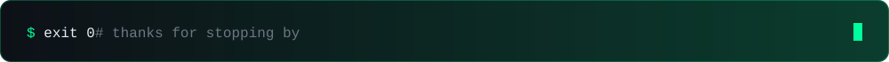

<div align="center">



<br/>


</div>

<br/>

## `~/whoami`

```bash
$ cat badis.json
{
  "name":     "Badis Jilani",
  "school":   "CESI Graduate School of Engineering (2023 → 2028, work-study)",
  "role":     "Digital Innovation & Emerging Technologies Officer @ TDF",
  "team":     "Exploration & Incubation",
  "approach": "AI-augmented development, from POC to MVP",
  "langs":    ["French (native)", "English (fluent)"],
  "seeking":  "12-week international internship, Summer 2027"
}
```

I work at the edge between **emerging tech and operations**: I prototype with LLMs, agents and automation, then turn the ones that hold up into real tools. I build with AI as a daily teammate (Claude Code, Copilot, Cursor) and I like shipping things that actually run.

<br/>

## `~/activity`

<div align="center">



<br/>

<picture>
  <source media="(prefers-color-scheme: dark)" srcset="https://raw.githubusercontent.com/Badis-J/Badis-J/output/github-contribution-grid-snake-dark.svg" />
  <source media="(prefers-color-scheme: light)" srcset="https://raw.githubusercontent.com/Badis-J/Badis-J/output/github-contribution-grid-snake.svg" />
  
</picture>

</div>

<br/>

## `~/missions` &nbsp;·&nbsp; at TDF

| Module | What I build | Stack |
|:--|:--|:--|
| **`5g-broadcast`** | Industrial Android app receiving live French TV channels over 5G Broadcast, using native MBMS APIs | `Kotlin` `Android` `MBMS` |
| **`ai-data`** | Text-to-SQL over complex databases, automated analysis tools combining Excel, prompt engineering and LLMs | `Python` `LLM` `SQL` |
| **`agents`** | Access-control agent on Azure AI Foundry. Fully on-premise data-mapping agent for data sovereignty | `Azure AI Foundry` `n8n` `local LLM` |
| **`mass-automation`** | Hybrid Excel/RPA pipelines for large-scale document migration and indexing into SharePoint | `Power Automate` `RPA` `SharePoint` |
| **`poc-lab`** | Image-to-3D, computer vision data labeling, Meta Quest 3D, Copilot Studio mini-game | `Computer Vision` `3D` `Copilot Studio` |
| **`tech-watch`** | Benchmarks on MCP, TTS/STT and AI coding assistants. Representation at VivaTech, Big Data & AI Paris, Microsoft AI Tour, AWS Summit | `MCP` `Cursor` `Claude Code` |

<br/>

## `~/projects`

```bash
$ ls -la projects/
```

<table>
<tr>
<td width="50%" valign="top">

#### ⚽ &nbsp;[FLA — Football Loisir Amateur](https://football-loisir-amateur.fr/)
Web platform of the amateur football association in Île-de-France: teams, championships, cups, tournaments, registrations and documents. I'm the IT manager and a referee for the association.

`Laravel` `PHP` `MySQL` `Production`

</td>
<td width="50%" valign="top">

#### 🐦 &nbsp;Breezy
Social media application built on a **microservices architecture** for a CESI distributed applications module.

`Microservices` `Distributed systems` `Private repo`

</td>
</tr>
<tr>
<td width="50%" valign="top">

#### 🏭 &nbsp;AI software factory
Personal project: an automated, agent-driven pipeline that goes from idea to deployed digital service, on a React/Node stack.

`AI agents` `React` `Node.js` `In progress`

</td>
<td width="50%" valign="top">

#### 🎲 &nbsp;[LifeGame](https://github.com/Badis-J/LifeGame)
Conway's Game of Life implemented with object-oriented programming in C++.

`C++` `OOP` `Public repo`

</td>
</tr>
</table>

> `// most of my work lives in private repositories (TDF and school projects). Happy to walk through it live.`

<br/>

## `~/stack`

<div align="center">


<br/>


<br/><br/>


</div>

<br/>

## `~/now`

```diff
+ building   AI agents and automation workflows at TDF
+ shipping   5G Broadcast experiments on Android
+ studying   Computer Engineering at CESI (until 2028)
+ looking    12-week international internship, Summer 2027
             targets: Canada, Nordics, Singapore
```

<br/>

<div align="center">

### `$ ./contact --open`

If you work on AI, data or innovation projects abroad, let's talk.

[](https://www.linkedin.com/in/badis-jilani/)
[](mailto:badis.jilani@gmail.com)

<br/>



</div>
